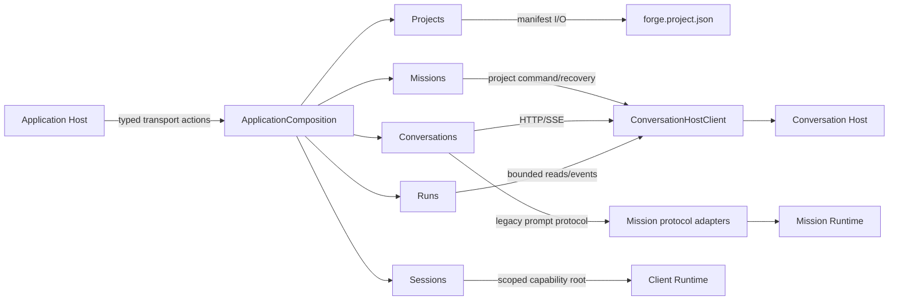

# Application

## Purpose

Provide the local application boundary behind the shared typed transport contract. It assembles concrete domain owners without making their state public or turning the host into a workflow coordinator.

## Why this exists

The Desktop needs one place for its Project-facing use cases and compatibility paths while durable coordination, mission reasoning, capability policy, rendering, and loopback HTTP remain separate concerns. This library keeps those local use cases composable through typed seams rather than a generic dispatcher.

## Owns

- Composition and application-lifetime disposal through [ApplicationComposition](ApplicationComposition.cs).
- [Projects](Projects/README.md), [Missions](Missions/README.md), [Conversations](Conversations/README.md), [Runs](Runs/README.md), and [Sessions](Sessions/README.md).
- The thin interaction bridges for capability dispatch and pending confirmations in [Interaction](Interaction/CapabilityActionService.cs); policy and execution stay in Client Runtime.
- Concrete compatibility protocol adapters: [Conversation Host](Adapters/Conversations/ConversationHostClient.cs), [legacy mission](Adapters/Missions/LegacyMissionProtocolClient.cs), [cloud mission](Adapters/Missions/LegacyCloudMissionProtocolClient.cs), and [legacy Janus delivery](Adapters/Janus/LegacyJanusToolDelivery.cs).

## Does not own

- Loopback HTTP/SSE, JSON encoding, readiness, or static assets — [Application Host](../ForgeMission.Application.Host/Program.cs).
- Local capability authorization, execution, audit, or cleanup — [Client Runtime](../ForgeMission.ClientRuntime/ClientExecutionSession.cs).
- Durable conversation state, mission reasoning, or remote execution recovery — the existing Conversation Host and Worker boundaries.
- Rendering, navigation, focus, or view state — [Presentation](../ForgeMission.Presentation/ForgeMission.Presentation.csproj).

## Change admission

A change belongs here only if it advances the reason this component exists.

For HTTP/SSE binding or static-asset hosting, compose with or change Application Host instead. For local capability policy or execution, compose with or change Client Runtime instead. For rendering, compose with or change Presentation instead.

## Use these pieces

- [ApplicationComposition](ApplicationComposition.cs) is the composition and disposal root. Its typed facade exposes [IProjectService](ApplicationComposition.cs), [IMissionSubmissionService](ApplicationComposition.cs), [IRunHistoryService](ApplicationComposition.cs), [IProjectContentService](ApplicationComposition.cs), [IConversationService](ApplicationComposition.cs), and [IApplicationSessionService](ApplicationComposition.cs) for Host registration; it is not a request dispatcher.
- The public transport DTOs and channel are in [ApplicationContracts](../ForgeMission.Application.Transport/ApplicationContracts.cs) and [IApplicationChannel](../ForgeMission.Application.Transport/IApplicationChannel.cs).
- Boundary coverage: [Application endpoint tests](../ForgeMission.Tests/Application/ApplicationEndpointsTests.cs), [Host route-boundary tests](../ForgeMission.Tests/Architecture/ApplicationHostRouteBoundaryTests.cs), and [compatibility-boundary tests](../ForgeMission.Tests/Architecture/ApplicationCompatibilityBoundaryTests.cs).

## Communicates with

## Important flows and constraints

- The Host resolves dependencies and registers each typed owner; endpoints call the matching interface and never receive internal Project or session state.
- Create/open starts an attachment only after Projects validates the Project. Composition creation itself performs no Project I/O or execution-session creation.
- Application disposal joins owned session disposal. Compatibility adapters retain the existing protocol behavior; they are not a new universal agent loop.
- Application is Native AOT compatible. Keep source-generated JSON behavior in the owning transport/host boundary; do not add reflective dispatch or service discovery.

## Related documentation

- [Phase 43.23 completed ownership evidence](../../docs/phases/phase-43.23-domain-ownership_completed.md#task-4--ownership-acceptance-and-documentation-2026-09-06)
- [Domain ownership end state](../../docs/retrospectives/phase-43-domain-ownership/end-state.md)
- [Ownership contracts](../../docs/retrospectives/phase-43-domain-ownership/contracts.md)
- [Forge architecture](../../docs/design/forge-architecture.md)
