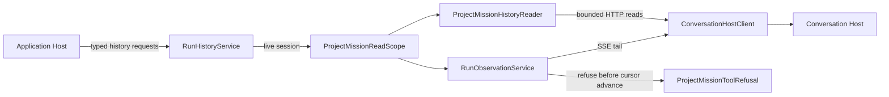

# Application Runs

## Purpose

Expose verified, bounded Project Mission state, run, and event reads while maintaining one session-scoped observation lifetime for invalidation and protocol safety.

## Why this exists

Reading canonical history and observing its changes have different lifetimes from submission and execution. Keeping them here prevents a UI or session map from becoming a second remote-history owner while preserving the required tool-refusal ordering.

## Owns

- Host-facing state, run-list, run-detail, and bounded event reads in [RunHistoryService](RunHistoryService.cs).
- The scoped composition of [ProjectMissionHistoryReader](ProjectMissionHistoryReader.cs), observation, and [ProjectMissionToolRefusal](../Adapters/Conversations/ProjectMissionToolRefusal.cs) in [ProjectMissionReadScope](ProjectMissionReadScope.cs).
- The presentation-facing immutable read projection in [ProjectRunReadState](ProjectRunReadState.cs).

## Does not own

- Submitting, retrying, or reconciling a Project Mission command — [Missions](../Missions/README.md).
- Canonical run/event persistence or sequencing — Conversation Host.
- Local capability authorization or tool execution — Client Runtime; refusal deliberately has no capability dependency.
- Long-lived application attachment ownership — [Sessions](../Sessions/README.md).

## Change admission

A change belongs here only if it advances the reason this component exists.

For command creation or retry policy, compose with or change Missions instead. For durable event persistence or ordering, compose with or change Conversation Host instead. For a tool grant or local execution, compose with or change Client Runtime instead.

## Use these pieces

- Host routes use [IRunHistoryService](../ApplicationComposition.cs) with [GetProjectMissionStateRequest](../../ForgeMission.Application.Transport/ApplicationContracts.cs), [GetProjectRunsRequest](../../ForgeMission.Application.Transport/ApplicationContracts.cs), and bounded detail/event requests.
- [RunHistoryService](RunHistoryService.cs) resolves the live application session; the scope then delegates bounded reads to [ProjectMissionHistoryReader](ProjectMissionHistoryReader.cs).
- [Run-history tests](../../ForgeMission.Tests/Application/RunHistoryServiceTests.cs), [read-state tests](../../ForgeMission.Tests/Application/ProjectRunReadStateTests.cs), and [tool-refusal tests](../../ForgeMission.Tests/Application/ProjectMissionToolRefusalTests.cs) prove the boundary.

## Communicates with

## Important flows and constraints

- The read scope starts observation before state evaluation and bounds it to one live application session; replacement/disposal closes the scope.
- Run detail and events remain container-validated and range-bounded. No unrestricted event download or implicit submission retry belongs here.
- Unexpected Project Mission tool requests are refused before the tail cursor advances; that path cannot reach Bob or a local executor.

## Related documentation

- [Run history and observation ownership](../../../docs/retrospectives/phase-43-domain-ownership/05-run-history-and-observation.md)
- [Shared-action contracts](../../../docs/retrospectives/phase-43-domain-ownership/contracts.md#shared-application-actions)
- [Task 4 final history boundary](../../../docs/phases/phase-43.23-domain-ownership_completed.md#task-4--ownership-acceptance-and-documentation-2026-09-06)
