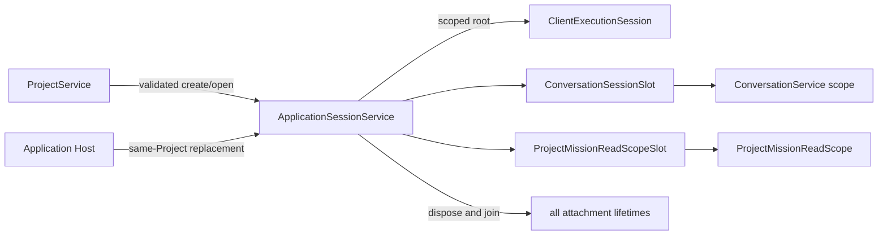

# Application Sessions

## Purpose

Bind a validated Project to immutable runtime/mission selection and coordinate disposal of its local execution, conversation, and read-scope attachments.

## Why this exists

Project identity, an application's selected attachment, and a local execution root have different lifetimes. This owner prevents session replacement from becoming an arbitrary-folder admission path or leaving a disposed conversation tail able to dispatch work.

## Owns

- The active application-session map and first attachment admission in [ApplicationSessionService](ApplicationSessionService.cs).
- Validated same-Project replacement, immutable mission/runtime selection, and joined shutdown disposal.
- Construction of the scoped [ClientExecutionSession](../../ForgeMission.ClientRuntime/ClientExecutionSession.cs), pending-confirmation handler, conversation slot, and Project Mission read-scope slot for an admitted attachment.

## Does not own

- Project creation, manifest validation, or the authority to choose a Project root — [Projects](../Projects/README.md).
- Capability authorization decisions, confirmation policy, execution, audit, or provider containment — Client Runtime.
- Durable conversation or run state — Conversation Host.
- Endpoint routing or HTTP status encoding — Application Host.

## Change admission

A change belongs here only if it advances the reason this component exists.

For Project-home validation or manifest mutation, compose with or change Projects instead. For capability policy or execution cleanup semantics, compose with or change Client Runtime instead. For durable conversation lifetime, compose with or change Conversation Host instead.

## Use these pieces

- [IApplicationSessionService](../ApplicationComposition.cs) is the Host-facing replacement seam; initial attachment is intentionally reachable only from [ProjectService](../Projects/ProjectService.cs).
- [ApplicationSessionService](ApplicationSessionService.cs) creates [ClientExecutionSession](../../ForgeMission.ClientRuntime/ClientExecutionSession.cs) only after Project admission.
- [Session-service tests](../../ForgeMission.Tests/Application/ApplicationSessionServiceTests.cs), [conversation-slot tests](../../ForgeMission.Tests/Application/ConversationSessionSlotTests.cs), and [Client Execution lifecycle tests](../../ForgeMission.Tests/ClientRuntime/ClientExecutionSessionTests.cs) cover replacement and cleanup.

## Communicates with

## Important flows and constraints

- Only ProjectService may create the first attachment. Replacement requires the outgoing session and the same Project home; invalid replacement stays a typed bad request.
- Admission, prompt setup, and disposal are serialized so a replaced session cannot start an orphaned conversation/tail.
- Disposal closes admission, drains replacements, and joins execution, conversation, and history observation cleanup. A session lookup is not a capability approval.

## Related documentation

- [Application-session ownership](../../../docs/retrospectives/phase-43-domain-ownership/08-application-session-management.md)
- [Local execution boundary](../../../docs/retrospectives/phase-43-domain-ownership/contracts.md#local-execution-boundary)
- [Lifecycle acceptance evidence](../../../docs/phases/phase-43.23-domain-ownership_completed.md#task-4--ownership-acceptance-and-documentation-2026-09-06)
