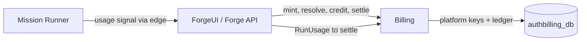

# Billing and Platform Keys

## Purpose

Own platform-key resolution and prepaid ledger operations as one account/accounting bounded context.

## Why this exists

Credential validity, balances, grants, and debits need a single authoritative store and idempotency boundary, separate from request routing and compute.

## Owns

- Platform-key minting/resolution, credit checks, pricing, grants, debits, Npgsql stores, and the `authbilling_db` schema.
- The AOT-safe service-registration boundary for those stores.

## Does not own

- HTTP/OIDC endpoints, mission execution, Rooms memberships, or runner cache/artifact storage.
- Durable Conversation storage, Desktop/Application state, or Bob-local credentials/capability authority.

## Change admission

A change belongs here only if it advances this component’s reason for existence.

For public route behavior, mission execution, or Rooms identity/membership, compose with the API/ForgeUI, Runner, or Rooms owner instead.

## Use these pieces

- [Billing orchestration](BillingService.cs), [platform-key resolver](PlatformKeyResolver.cs), and [key minting](PlatformKeyMinting.cs)
- [Npgsql store registration](BillingServiceCollectionExtensions.cs) and [schema](AuthBillingSchema.cs)
- Boundary coverage: [ledger settlement](../ForgeMission.Rooms.Tests/LedgerTests.cs), [key resolution](../ForgeMission.Rooms.Tests/PlatformKeyResolverTests.cs), and [minting](../ForgeMission.Rooms.Tests/PlatformKeyMintingTests.cs)

## Communicates with

## Important flows and constraints

- The presented secret is verified at the edge against a cached hash; the cache never holds the raw secret.
- `RunUsage` is priced and settled here, with client-token idempotency where the caller has one.
- Do not reintroduce ledger or platform-key tables into `ForgeMission.Rooms.Data`; the contexts have separate stores.

## Related documentation

- [Security architecture](../../docs/design/security-architecture.md)
- [Deploy runbook](../../docs/design/deploy.md)
- [Phase 43.23 completed ownership evidence](../../docs/phases/phase-43.23-domain-ownership_completed.md)
