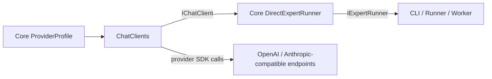

# Chat Clients

## Purpose

Builds provider-backed `IChatClient` and `IExpertRunner` instances from Core provider profiles.

## Why this exists

Provider SDKs and their protocol differences must stay below MCL execution. This boundary lets Core depend on provider-neutral contracts while one focused project translates supported provider configuration.

## Owns

- [`ChatClients.Build`](ChatClients.cs) and [`ChatClients.BuildChatClient`](ChatClients.cs) for supported profile values.
- OpenAI-compatible OpenAI/Azure, Ollama, and xAI client construction.
- Anthropic response-format adaptation in [`AnthropicResponseFormatChatClient`](ChatClients.cs).

## Does not own

- MCL parsing, profile discovery, command-line configuration, mission execution policy, or web-search configuration.

## Change admission

A change belongs here only if it advances construction or protocol adaptation for a supported chat provider behind Core contracts. For profile discovery change `ForgeMission.Core`; for CLI wiring change `ForgeMission.Cli`.

## Use these pieces

- [`ChatClients`](ChatClients.cs) is the public factory used by CLI and mission-serving hosts.
- [`ProviderProfile`](../ForgeMission.Core/Manifest/ForgeManifest.cs) is the incoming profile shape.
- [`DirectExpertRunner`](../ForgeMission.Core/Adapters/DirectExpertRunner.cs) is the Core adapter returned by `Build`.
- [`DirectExpertRunnerTests`](../ForgeMission.Tests/Adapters/DirectExpertRunnerTests.cs) cover the provider-neutral runner boundary.

## Communicates with

## Important flows and constraints

- Provider names are normalized by the factory; unknown values fail explicitly.
- Ollama and xAI use the OpenAI-compatible client with their own default endpoints.
- Anthropic structured output is translated at this boundary; do not leak native provider types into Core.

## Related documentation

- [Provider boundary and supported clients](../../docs/design/architecture.md)
- [AOT rules](../../AGENTS.md#aot-first--standing-rules-for-all-new-code)
