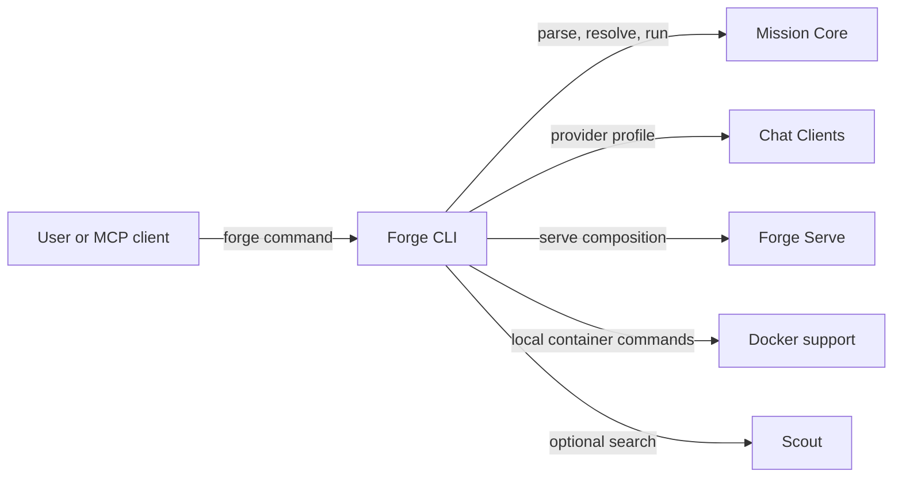

# Forge CLI

## Purpose

Exposes the `forge` executable and composes existing components into user-facing commands.

## Why this exists

People need one command surface for mission lifecycle, execution, serving, and supported local helpers. Keeping that surface thin prevents command handling from becoming a second owner of language, provider, or runtime behavior.

## Owns

- The executable entry point and command registration in [`Program`](Program.cs).
- Command input/output, mission-file selection, and composition of Core, Chat Clients, Docker, Scout, and Serve.
- CLI-specific OCI pulls, platform sign-in, built-in mission references, and MCP command wiring.

## Does not own

- MCL syntax or execution semantics, provider SDK adaptation, Docker process protocol, web-search implementation, or HTTP wire mapping.

## Change admission

A change belongs here only if it advances the `forge` command surface or composes existing owners. For mission behavior change `ForgeMission.Core`; for provider construction, Docker control, search, or HTTP serving change the corresponding component rather than duplicating it in a command.

## Use these pieces

- [`Program`](Program.cs) registers every command and is the executable entry point.
- [`ForgeExec`](ForgeExec.cs) is the shared CLI execution helper; [`ProviderClientBuilder`](ProviderClientBuilder.cs) wires optional live search.
- [`ChatClients`](../ForgeMission.ChatClients/ChatClients.cs), [`ForgeServe`](../ForgeMission.Serve/ForgeServe.cs), and [`DockerCli`](../ForgeMission.Docker/DockerCli.cs) are composed owners.
- [`MissionFileResolutionTests`](../ForgeMission.Tests/Cli/MissionFileResolutionTests.cs), [`BuiltinMissionsTests`](../ForgeMission.Tests/Cli/BuiltinMissionsTests.cs), and [`ForgeExecUrlInputTests`](../ForgeMission.Tests/Cli/ForgeExecUrlInputTests.cs) cover CLI-specific behavior.

## Communicates with

## Important flows and constraints

- The published executable is Native AOT; preserve source-generated and reflection-safety requirements in its dependency graph.
- `Program` is composition code, not a home for provider or pipeline business logic.
- CLI defaults and command semantics are part of the public product surface; keep errors and argument handling explicit.

## Related documentation

- [CLI architecture](../../docs/design/architecture.md)
- [MCL language](../../docs/design/language.md)
- [Release workflow](../../AGENTS.md#release-workflow)
