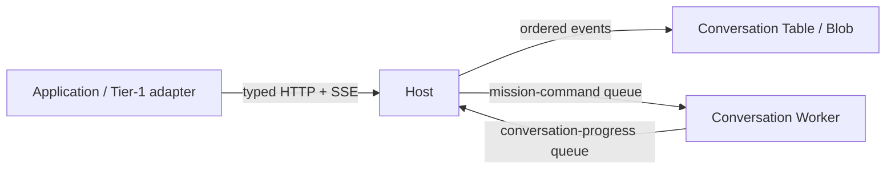

# Conversation Host

## Purpose

Own the durable coordination boundary for conversation commands, ordered facts, replay, and run projections.

## Why this exists

One service must serialize conversation mutation and retain canonical state so reconnects and at-least-once delivery cannot create a competing history.

## Owns

- Orleans grains, sequence allocation, command/progress acceptance, Table/Blob persistence, Project Mission indexes, the rebuildable Project-keyed Mission Conversation directory, and hidden Evaluation projections.
- Generic mission-hands attachment liveness and request/result correlation on the canonical Conversation grain; `AwaitingHands` is an ordered durable fact, never a fallback.
- HTTP/SSE projections and Service Bus dispatch/consumption for the Conversation bounded context.

## Does not own

- Mission reasoning or provider execution (the Worker owns those).
- Platform identity/billing, Rooms data, Desktop/Application state, or Bob’s local capability authorization and execution.

## Change admission

A change belongs here only if it advances this component’s reason for existence.

For mission execution, caller identity, billing, or local tools, compose with the Worker, platform edge, or Client Runtime owner instead.

## Use these pieces

- [Service composition and health entry point](Program.cs)
- [Transport-neutral handlers and HTTP/SSE route projection](Api/ConversationApiEndpoints.cs)
- [Canonical conversation owner](Grains/ConversationGrain.cs) and [run state machine](Grains/MissionRunGrain.cs)
- Boundary coverage: [API routes](../ForgeMission.ConversationHost.Tests/ConversationApiTests.cs), [grain recovery](../ForgeMission.ConversationHost.Tests/ConversationGrainTests.cs), and [persistence](../ForgeMission.ConversationHost.Tests/ConversationPersistenceTests.cs)

## Communicates with

## Important flows and constraints

- The Host is the sole Conversation-store writer and grain caller; other bounded contexts do not query its stores directly.
- Queue delivery is at least once; stable IDs and grain acceptance make recovery idempotent.
- Host independently validates a generic immutable package before queueing it and again at the grain boundary; malformed or inconsistent content cannot reach Worker/provider execution.
- Mission Conversation turn/attempt IDs, retry/cancel order, evaluation trace origins, and directory repair are Host-owned durable facts. The directory is metadata over canonical checkpoints, not a Project store or transcript copy.
- An evaluation records its declared profile only as provenance, then dispatches an immutable `NoHands` launch with no attachment or local capability declaration.
- A Worker hands pause becomes one canonical `MissionHandsRequested` fact. After the exact correlated result is committed, Host dispatches its one deterministic generic continuation.
- Current routes are an adapter projection, not the semantic definition of the shared messages. Tier-1 callers must supply identity through their own boundary; the current local API has a development tenant seam.

## Related documentation

- [Durable conversations](../../docs/design/durable-conversations.md)
- [Security architecture](../../docs/design/security-architecture.md)
- [Phase 43.23 completed ownership evidence](../../docs/phases/phase-43.23-domain-ownership_completed.md)
