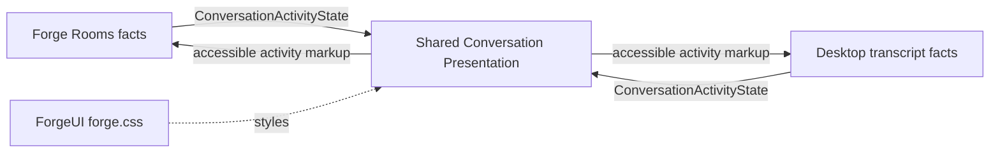

# Shared Conversation Presentation

## Purpose

Supplies the small activity-state projection and accessible renderer used inside both Rooms and Desktop conversation transcripts.

## Why this exists

The two surfaces need the same in-transcript activity semantics without sharing conversation state, transport clients, or a theme. Keeping the projection here prevents either surface from becoming the canonical owner of the visual contract.

## Owns

- The fixed [`ConversationActivityKind`](ConversationActivityKind.cs) vocabulary and [`ConversationActivityState`](ConversationActivityState.cs) projection.
- The presentation-only [`ConversationActivity`](ConversationActivity.razor) renderer and its accessibility semantics.

## Does not own

- Conversation state, event subscriptions, progress generation, transport, navigation, persistence, or CSS/theme ownership.

## Change admission

A change belongs here only if it advances the shared activity projection or its renderer. For facts that create activity state change the hosting surface; for styling change the existing Forge CSS authority rather than adding a theme here.

## Use these pieces

- [`ConversationActivityState`](ConversationActivityState.cs) is the single input to the renderer.
- [`ConversationActivity`](ConversationActivity.razor) renders the fixed state vocabulary.
- [`RoomConversation`](../ForgeUI/Shared/RoomConversation.razor) and [`ConversationTranscriptView`](../ForgeMission.Presentation/Components/ConversationTranscriptView.razor) map their own facts into this state.
- [`ConversationActivityTests`](../ForgeMission.Tests/Presentation/ConversationActivityTests.cs) prove shared rendering and no Forge-assembly dependency.

## Communicates with

## Important flows and constraints

- The three activity kinds are fixed; a fourth state needs a separately justified component change.
- Hosts create the projection from facts they already hold; this library opens no connection and retains no conversation state.
- Styling remains in `ForgeUI/wwwroot/css/forge.css`, shared by both hosts.

## Related documentation

- [Shared conversation activity surface](../../docs/phases/phase-43.18-shared-conversation-activity.md)
- [Desktop interaction principles](../../docs/design/desktop-interaction-principles.md)
- [UI design system](../../docs/design/ui-design-system.md)
