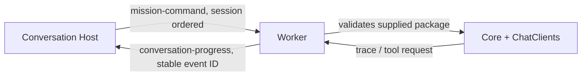

# Conversation Worker

## Purpose

Execute admitted immutable durable packages and report generic semantic progress back to the Conversation service.

## Why this exists

Mission/provider work must be independently restartable while the durable Host retains ordering and recovery authority.

## Owns

- Service Bus command consumption, worker session/retry state, generic Core execution, and progress publishing.
- One deployment-owned `default` provider runner; package content cannot select a provider or credential.
- Mapping generic Core traces and root pauses into shared `ConversationProgress` and Mission Hands facts.

## Does not own

- Conversation sequencing, HTTP/SSE, Orleans grains, or Conversation Table/Blob state.
- Platform authentication/billing, Rooms/Desktop stores, or local filesystem/terminal capability execution.

## Change admission

A change belongs here only if it advances this component’s reason for existence.

For durable state, user-facing transport, or local tool authority, compose with the Host, Tier-1 adapter, or Client Runtime owner instead.

## Use these pieces

- [Worker composition](Program.cs)
- [Command-to-progress orchestration](Messaging/MissionCommandProcessor.cs)
- [Generic executor](Messaging/GenericDurableMissionExecutor.cs) and [command processing](Messaging/MissionCommandProcessor.cs)
- Boundary coverage: [generic command processing](../ForgeMission.ConversationWorker.Tests/GenericDurableMissionProcessorTests.cs)

## Communicates with

## Important flows and constraints

- The Worker never references Conversation Host, Orleans, or Conversation storage; it receives all needed command data on the queue.
- A command is completed only after its progress fact is broker-accepted; redelivery reuses deterministic IDs.
- A requested local tool is a fact for the Host/client flow, not permission for this Worker to access a Desktop or Bob capability provider.

## Related documentation

- [Durable conversations](../../docs/design/durable-conversations.md)
- [Forge architecture](../../docs/design/forge-architecture.md)
- [Phase 43.23 completed ownership evidence](../../docs/phases/phase-43.23-domain-ownership_completed.md)
