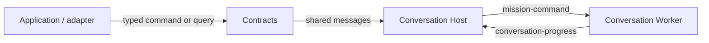

# Durable Conversation Contracts

## Purpose

Provide the small shared vocabulary for the durable Conversation service and its callers.

## Why this exists

Durable conversation facts need stable identities and shapes without coupling every caller to HTTP, Orleans, Azure, or mission execution.

## Owns

- Versioned conversation commands, event/snapshot/projection records, JSON source generation, and deterministic IDs.
- Additive generic mission-hands launch, attachment, request, and typed-result records. They contain no Project root, credential, Bob handle, or Worker transcript.
- The additive immutable durable-package and generic Mission Hands vocabulary; package content has no provider or credential fields.
- Additive Mission Conversation turn and hidden Evaluation messages. They carry immutable package values and IDs only; no Project path, attachment, capability authority, credential, or local root crosses this vocabulary.

## Does not own

- HTTP/SSE routes, grain sequencing, queues, Table/Blob state, or Worker reasoning.
- Caller authentication, platform keys, billing, Desktop state, or Bob’s local capability policy/execution.

## Change admission

A change belongs here only if it advances this component’s reason for existence.

For transport, storage, execution, or caller-policy behavior, compose with the Host, Worker, or caller-specific owner instead.

## Use these pieces

- [Conversation contracts and route messages](ConversationContracts.cs)
- [JSON context](ConversationContractsJsonContext.cs) and [deterministic IDs](ConversationDeterministicIds.cs)
- Boundary coverage: [serialization](../ForgeMission.ConversationHost.Tests/ConversationContractsRoundTripTests.cs) and [contract isolation](../ForgeMission.ConversationHost.Tests/ConversationContractsBoundaryTests.cs)

## Communicates with

## Important flows and constraints

- Event sequence numbers are assigned by the Host, never the Worker.
- Preserve enum ordering and additive record evolution: persisted checkpoints and wire clients rely on them.
- Project Mission messages deliberately contain no capability declaration; a direct caller cannot grant local-tool authority.

## Related documentation

- [Durable conversations](../../docs/design/durable-conversations.md)
- [Phase 43.23 completed ownership evidence](../../docs/phases/phase-43.23-domain-ownership_completed.md)
