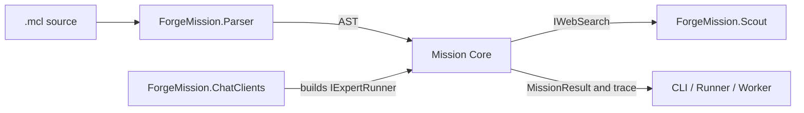

# Mission Core

## Purpose

Supplies the provider-neutral implementation of MCL mission loading, resolution, and execution, plus reusable contracts and primitives shared by hosts.

## Why this exists

Mission semantics must be executable without coupling the language runtime to a particular provider, executable host, or Desktop domain. This project keeps those durable semantics and shared primitives in one AOT-compatible library.

## Owns

- Expert definitions and loading, mission/lock-file resolution, and `forge.toml` manifest reading.
- Pipeline execution, trace/result contracts, and the provider-neutral [`IExpertRunner`](Runtime/IExpertRunner.cs) seam.
- Reusable workspace and capability contracts, dispatch primitives, and tool executors.

## Does not own

- Provider SDK selection or credentials, command-line UX, HTTP serving, Project/conversation state, or Desktop process supervision.
- The scoped local-capability authority: Client Runtime (Bob) composes these capability primitives and owns its policy, admission, confirmation, audit, and lifetime.

## Change admission

A change belongs here only if it advances provider-neutral MCL execution, resolution, or a reusable contract/primitives boundary. For provider construction change `ForgeMission.ChatClients`; for scoped local capability authority compose with `ForgeMission.ClientRuntime`.

## Use these pieces

- [`PipelineRunner`](Runtime/PipelineRunner.cs) executes a parsed mission with resolved experts and named runners; its root-scoped continuation seam pauses and resumes declared nested tool requests without holding capability authority.
- [`IExpertRunner`](Runtime/IExpertRunner.cs) is the only runner abstraction used by the pipeline.
- [`ExpertResolver`](Resolution/ExpertResolver.cs), [`ExpertLoader`](Experts/ExpertLoader.cs), and [`ForgeTomlReader`](Manifest/ForgeTomlReader.cs) provide the resolution inputs.
- [`PipelineRunnerTests`](../ForgeMission.Tests/Runtime/PipelineRunnerTests.cs) and [`CapabilityDispatcherTests`](../ForgeMission.Tests/Tools/CapabilityDispatcherTests.cs) cover execution and capability contracts.

## Communicates with

## Important flows and constraints

- The parser only establishes syntax; expert resolution is eager and fails before execution.
- The pipeline selects a named runner per `using` profile and never takes provider-specific types.
- AOT callers must retain source-generated JSON and the existing reflection-preservation rules; do not introduce runtime reflection as a convenience.

## Related documentation

- [Architecture](../../docs/design/architecture.md)
- [Language design](../../docs/design/language.md)
- [Phase 43.23 ownership end state](../../docs/retrospectives/phase-43-domain-ownership/end-state.md)
