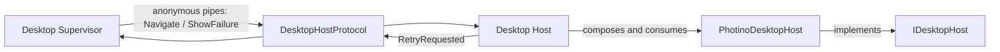

# Desktop Host Contracts

## Purpose

Defines the minimal stable seam shared by the Desktop Supervisor and native Host process.

## Why this exists

The Supervisor must control a disposable native shell without depending on its framework. A small dependency-free contract makes the selected host adapter replaceable.

## Owns

- [`IDesktopHost`](IDesktopHost.cs), the native window/WebView abstraction used only by the Host executable.
- [`DesktopHostProtocol`](DesktopHostProtocol.cs), command/event records and pipe framing.

## Does not own

- Process startup or cleanup, a concrete WebView, retries as a general event system, Application URLs, credentials, or runtime state.

## Change admission

A change belongs here only if it is required by the fixed Supervisor-to-Host contract. For lifecycle semantics change `ForgeMission.Desktop`; for framework behavior change the selected adapter.

## Use these pieces

- [`IDesktopHost`](IDesktopHost.cs) is the Host-only programming seam.
- [`DesktopHostProtocol`](DesktopHostProtocol.cs) reads and writes the framed `Navigate`, `ShowFailure`, and `RetryRequested` messages.
- [`DesktopSupervisorHostBoundaryTests`](../ForgeMission.Tests/Architecture/DesktopSupervisorHostBoundaryTests.cs) protect the dependency boundary.

## Communicates with

## Important flows and constraints

- The protocol has two commands and one event; unknown frame kinds fail instead of being ignored.
- Closing the Host is observed by the Supervisor, which owns cleanup; `IDesktopHost` has no close veto.
- This project has no project dependencies and must stay framework-neutral.

## Related documentation

- [Desktop host abstraction](../../docs/design/forge-architecture.md#desktop-host-abstraction-idesktophost)
- [Phase 43.23 boundary evidence](../../docs/phases/phase-43.23-domain-ownership_completed.md#task-4--ownership-acceptance-and-documentation-2026-09-06)
