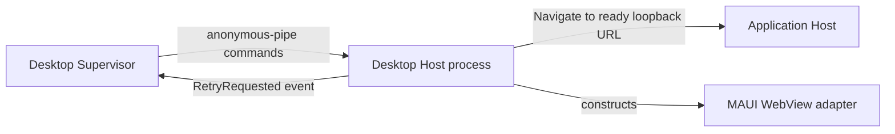

# Desktop Host

## Purpose

Runs the native window/WebView process and translates the fixed pipe contract into local boot/failure content or navigation.

## Why this exists

The user-visible shell needs to remain disposable and independent of runtime ownership. A separate process lets the Supervisor clean up the real runtime when the window exits unexpectedly.

## Owns

- The MAUI executable composition root in [`MauiProgram`](MauiProgram.cs), inherited-pipe handling,
  command application, and the local WebView.
- Local Booting/Failed markup in [`HostContent`](HostContent.cs), including the single Retry affordance.

## Does not own

- Process supervision, cleanup, credentials, Application configuration, Project state, application routes, or capability execution.

## Change admission

A change belongs here only if it advances the disposable native-host process or its fixed command handling. For lifecycle policy change `ForgeMission.Desktop`; this Windows spike owns its MAUI WebView implementation here.

## Use these pieces

- [`MauiProgram`](MauiProgram.cs) is the native Host composition root; Windows starts the MAUI app loop.
- [`DesktopHostController`](DesktopHostController.cs) requires the inherited pipe handles from the Supervisor.
- [`HostContent`](HostContent.cs) supplies the Host-owned startup/failure documents.
- [`IDesktopHost`](../ForgeMission.Desktop.Contracts/IDesktopHost.cs) is the abstraction it composes.

## Communicates with

## Important flows and constraints

- It starts with local content before any Application URL, credential, or runtime is available.
- MAUI runs its native loop; pipe reads occur on a background thread and adapter calls marshal to MAUI's UI thread.
- When the Supervisor pipe closes, this process exits rather than becoming an orphan window.

## Related documentation

- [Desktop Supervisor/native Host boundary](../../docs/design/forge-architecture.md#desktop-supervisor-and-native-host-are-separate-processes)
- [Desktop interaction principles](../../docs/design/desktop-interaction-principles.md)
