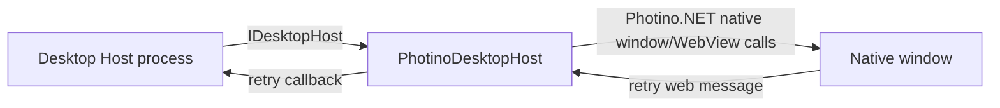

# Photino Desktop Host Adapter

## Purpose

Implements the local native-window/WebView operations required by `IDesktopHost` using Photino.NET.

## Why this exists

Photino is a replaceable implementation detail. Isolating it keeps framework-specific threading and WebView calls out of the Host process composition and the Desktop Supervisor.

## Owns

- [`PhotinoDesktopHost`](PhotinoDesktopHost.cs), including native-loop ownership, cross-thread marshalling, navigation, local-content loading, and the Retry message translation.
- The sole `Photino.NET` package dependency.

## Does not own

- Pipe protocol, process lifecycle, boot/retry policy, Application transport, credentials, or any Application/Client Runtime behavior.

## Change admission

A change belongs here only if it advances the current `IDesktopHost` implementation. For a new shell interaction first decide whether the framework-neutral contract must change; do not put Supervisor policy in this adapter.

## Use these pieces

- [`PhotinoDesktopHost`](PhotinoDesktopHost.cs) is the public sealed adapter implementing [`IDesktopHost`](../ForgeMission.Desktop.Contracts/IDesktopHost.cs).
- [`ForgeMission.Desktop.Host/Program`](../ForgeMission.Desktop.Host/Program.cs) is its only composition consumer.

## Communicates with

## Important flows and constraints

- The constructing main thread owns the native window; background pipe commands marshal through Photino `Invoke` after creation.
- Only the literal `retry` web message is accepted.
- Replacing Photino should require changing this adapter and Host composition, not Application or Supervisor behavior.

## Related documentation

- [Why the shell is disposable](../../docs/design/forge-architecture.md#why-photino-specifically-the-shell-is-intentionally-disposable)
- [Desktop host abstraction](../../docs/design/forge-architecture.md#desktop-host-abstraction-idesktophost)
