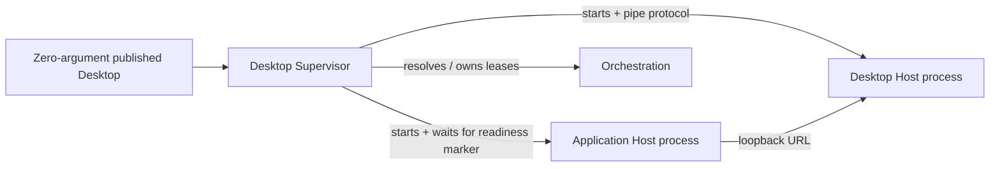

# Desktop Supervisor

## Purpose

Provides the published zero-argument Desktop entry point and owns startup, readiness, failure presentation, and cleanup of its child processes and owned runtime dependencies.

## Why this exists

The native window must be disposable while lifecycle decisions stay centralized. This process boundary ensures a window close or crash cannot leave supervised children behind.

## Owns

- The user entry point in [`DesktopSupervisor`](Program.cs), boot composition in [`DesktopBoot`](DesktopBoot.cs), and exactly-once cleanup in [`DesktopLifecycle`](DesktopLifecycle.cs).
- Starting and stopping the Application Host through [`ApplicationHostProcess`](ApplicationHostProcess.cs), and the native Host through [`HostProcess`](HostProcess.cs).

## Does not own

- Native WebView implementation, Application HTTP routes/business rules, Project operations, local capability policy, or remote durability/reasoning.

## Change admission

A change belongs here only if it advances supervision, owned dependency resolution, or lifecycle cleanup. For window behavior change `ForgeMission.Desktop.Host`; for runtime resolution change `ForgeMission.Orchestration`.

## Use these pieces

- [`DesktopSupervisor.Main`](Program.cs) is the published executable entry point; an optional URL argument is dev/test convenience, not the normal path.
- [`DesktopLifecycle`](DesktopLifecycle.cs) is the lifecycle/state owner.
- [`DesktopLifecycleTests`](../ForgeMission.Tests/Desktop/DesktopLifecycleTests.cs) protect ordering and exactly-once cleanup.

## Communicates with

## Important flows and constraints

- The native Host starts before slow boot work and shows its own Booting/Failed content.
- Cleanup is reverse dependency order: Application Host, any owned conversation tunnel, then any launched Mission Runtime.
- The observed `FORGE_CLIENT_RUNTIME_URL=` marker is intentionally retained for Application Host readiness compatibility.

## Related documentation

- [Desktop default path](../../docs/design/default-path-acceptance.md#current-default-facts)
- [Desktop process boundary](../../docs/design/forge-architecture.md#desktop-supervisor-and-native-host-are-separate-processes)
