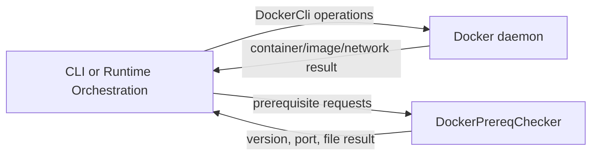

# Docker Support

## Purpose

Provides narrowly scoped Docker CLI operations and prerequisite checks to callers that decide whether to start and stop local containers.

## Why this exists

Docker invocation details should not be replicated across CLI and Desktop orchestration, but this library must not acquire mission or process-supervision authority merely because it can invoke Docker.

## Owns

- Docker API/CLI calls in [`DockerCli`](DockerCli.cs), including image, network, and container operations.
- Ordered prerequisite checks and their result shape in [`DockerPrereqChecker`](DockerPrereqChecker.cs) and [`PrereqCheck`](PrereqCheck.cs).

## Does not own

- Which runtime mode is selected, user commands, mission execution, Docker image content, or lifecycle policy for a caller’s process.

## Change admission

A change belongs here only if it advances reusable Docker command or prerequisite behavior. For runtime selection and ownership of a started adapter change `ForgeMission.Orchestration`; for command UX change `ForgeMission.Cli`.

## Use these pieces

- [`DockerCli`](DockerCli.cs) performs the supported Docker operations.
- [`DockerPrereqChecker`](DockerPrereqChecker.cs) produces and short-circuits ordered checks.
- [`DockerCliTests`](../ForgeMission.Tests/ClientRuntime/DockerCliTests.cs) cover request construction.
- [`LocalDockerMissionRuntimeLauncher`](../ForgeMission.Orchestration/LocalDockerMissionRuntimeLauncher.cs) is a lifecycle-owning consumer.

## Communicates with

## Important flows and constraints

- `Evaluate` marks checks after the first failure as skipped, preserving ordered diagnostics.
- Callers, not this library, decide whether a container is owned and must be cleaned up.
- This is support code; it does not turn Docker availability into a product runtime default.

## Related documentation

- [Runtime orchestration boundary](../ForgeMission.Orchestration/README.md)
- [Local development environment](../../docs/design/deploy.md#local-dev-environment--shell--provider-keys-read-this-before-running-anything-locally)
