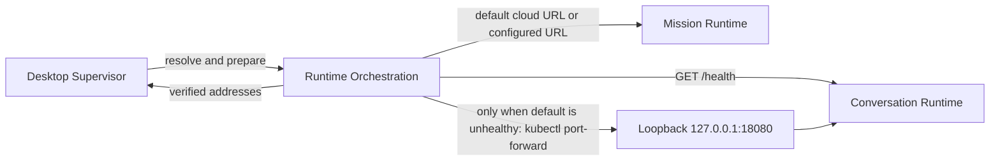

# Runtime Orchestration

## Purpose

Resolves the Mission and durable Conversation Runtime addresses used by the Desktop Supervisor, verifies readiness, and manages only local adapters it starts.

## Why this exists

Dependency selection and local-development startup must not become Application behavior or native-shell policy. This library isolates that operational wiring while preserving the remote owners' authority.

## Owns

- Mission mode/endpoint resolution in [`MissionRuntimeResolver`](MissionRuntimeResolver.cs), including the cloud default.
- Conversation endpoint resolution, health readiness, and any owned Kind loopback tunnel through [`ConversationRuntimeBootstrap`](ConversationRuntimeBootstrap.cs).
- Optional local Docker Mission Runtime lifecycle and its configuration helpers.

## Does not own

- Application HTTP clients or business rules, Project data, remote Conversation Host durability, Mission Worker reasoning, platform identity, or user window lifecycle.

## Change admission

A change belongs here only if it advances runtime address resolution, readiness, or lifecycle of an adapter this library starts. For remote protocol behavior change the Application adapter; for process supervision change `ForgeMission.Desktop`.

## Use these pieces

- [`MissionRuntimeResolver.ResolveAsync`](MissionRuntimeResolver.cs) produces a URL, mode, and optional owned launcher.
- [`ConversationRuntimeBootstrap.PrepareAsync`](ConversationRuntimeBootstrap.cs) returns a verified base URL and a disposable lease only for a tunnel it started.
- [`MissionRuntimeResolverTests`](../ForgeMission.Tests/Orchestration/MissionRuntimeResolverTests.cs) and [`ConversationRuntimeBootstrapTests`](../ForgeMission.Tests/Orchestration/ConversationRuntimeBootstrapTests.cs) prove the resolver/ownership rules.

## Communicates with

## Important flows and constraints

- With no Mission configuration, cloud mode resolves to `https://api.forge.katasec.com`.
- With no Conversation base URL, the default is `http://127.0.0.1:18080/` and readiness is `GET /health`.
- A configured or already-healthy endpoint is never stopped; a lease disposes only the tunnel this library started.

## Related documentation

- [Current default facts](../../docs/design/default-path-acceptance.md#current-default-facts)
- [Runtime supervision boundary](../../docs/retrospectives/phase-43-domain-ownership/end-state.md#actors-and-boundaries)
