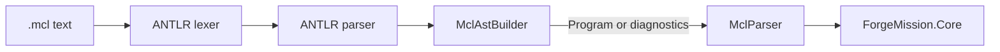

# MCL Parser

## Purpose

Turns MCL source text into the typed AST and diagnostics consumed by the mission core.

## Why this exists

Syntax acceptance must be deterministic and independent of filesystems, registries, providers, and execution. A separate parser keeps language changes reviewable as syntax and AST changes rather than host behavior.

## Owns

- The public [`MclParser`](MclParser.cs) parse and best-effort diagnostic APIs.
- AST records and source spans in [`Ast`](Ast.cs).
- The ANTLR-generated lexer/parser and the internal AST builder that maps parse trees into those records.

## Does not own

- Expert existence/resolution, manifest loading, runtime validation, pipeline execution, provider profiles, or CLI error presentation.

## Change admission

A change belongs here only if it advances MCL syntax, parse diagnostics, or the AST representation. For semantic validation or execution behavior change `ForgeMission.Core`; do not add filesystem or provider access here.

## Use these pieces

- [`MclParser.Parse`](MclParser.cs) throws [`ParseException`](ParseException.cs) for callers that require valid source.
- [`MclParser.TryParse`](MclParser.cs) returns [`ParseResult`](MclParser.cs) for tooling that must retain diagnostics.
- [`Ast`](Ast.cs) is the typed handoff to Core.
- [`ParserTests`](../ForgeMission.Tests/Parser/ParserTests.cs) and [`SourcePositionTests`](../ForgeMission.Tests/Parser/SourcePositionTests.cs) protect syntax and spans.

## Communicates with

## Important flows and constraints

- Parsing is pure: callers supply text and receive an AST or diagnostics.
- `Parse` and `TryParse` share the same grammar path; tooling should use `TryParse` rather than recover from exceptions.
- Generated parser files are an implementation of the grammar, not a place to hand-edit language behavior.

## Related documentation

- [Language grammar and syntax decisions](../../docs/design/language.md)
- [Parse/resolve/execute architecture](../../docs/design/architecture.md#execution-phases)
