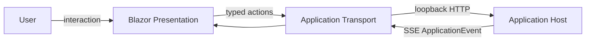

# Presentation

## Purpose

Renders the Forge launcher and workbench and translates user intent into typed Application Transport actions.

## Why this exists

View state and interaction must remain replaceable without becoming a second owner of Project, mission, or capability rules.

## Owns

- The WebAssembly entry point and channel registration in [`Program`](Program.cs).
- Components, rendering, navigation, focus, subscriptions, and local view state, centered on [`Home`](Pages/Home.razor) and [`WorkbenchView`](Components/WorkbenchView.cs).

## Does not own

- Project validation or manifest I/O, selection/submission rules, run durability, local capability authority, HTTP endpoint binding, or native-host lifecycle.

## Change admission

A change belongs here only if it advances rendering, navigation, focus, or view state. For a domain decision compose with Application through `IApplicationChannel`; do not reproduce it in a component.

## Use these pieces

- [`Program`](Program.cs) installs the scoped [`IApplicationChannel`](../ForgeMission.Application.Transport/IApplicationChannel.cs).
- [`Home`](Pages/Home.razor) is the routed application surface and subscribes to application events.
- [`WorkbenchView`](Components/WorkbenchView.cs) names presentation-only view states.
- [`MissionsLandingView`](Components/MissionsLandingView.razor) is the Missions destination: durable
  mission conversations as informational rows, with no control that would imply opening one.
- [`MissionAuthoringView`](Components/MissionAuthoringView.razor) and
  [`EvaluationCaseEditor`](Components/EvaluationCaseEditor.razor) are the Explorer authoring
  document: definition, cases, evidence and publish. Publish is disabled with Application's own
  stated reason; Application refuses a blocked publish regardless.
- [`NewMissionConversationPanel`](Components/NewMissionConversationPanel.razor) chooses an Approved
  version and repeats the access it fixes read-only. It contains no control that could select,
  narrow, or widen a profile.
- [`ConversationTranscriptView`](Components/ConversationTranscriptView.razor) renders one durable
  conversation transcript projection — user, participant, activity, approval, tool and status rows.
- [`ConversationMarkdownRenderer`](Components/ConversationMarkdownRenderer.cs) is the **sole** Markdig
  seam: a fixed, inert pipeline used only for participant messages.

## Communicates with

## Important flows and constraints

- A Project session starts an event subscription and is stopped before a replacement session takes over.
- Presentation renders durable conversation/run facts returned by the Application; it does not synthesize them.
- Static assets are served by Application Host, not by the native Host.
- `ConversationMarkdownRenderer` owns no transport, conversation facts, navigation, or media. Its
  pipeline is fixed (pipe tables and task lists only, never `UseAdvancedExtensions()`), links and
  images render as escaped text, and `DisableHtml()` must stay the **last** builder call — on
  Markdig 1.3.2 any `Use<>()` after it silently restores the raw-HTML parsers. It is the only source
  whose output may bypass Razor encoding; every other transcript row stays Razor-encoded. See
  [43.24](../../docs/phases/phase-43.24-conversation-markdown-rendering.md).

## Related documentation

- [Desktop interaction principles](../../docs/design/desktop-interaction-principles.md)
- [UI design system](../../docs/design/ui-design-system.md)
- [Ownership end state](../../docs/retrospectives/phase-43-domain-ownership/end-state.md#actors-and-boundaries)
