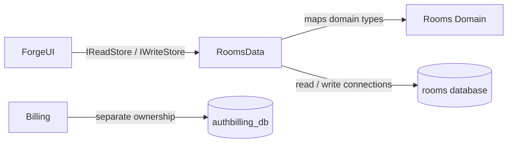

# Rooms Data

## Purpose

Persist the Rooms domain while keeping read/write intent and future replica routing explicit at the storage boundary.

## Why this exists

Collaboration data needs relational constraints and migrations, but neither the web host nor the domain model should own EF Core configuration or database mechanics.

## Owns

- Rooms EF Core contexts, mappings, migrations, seeding, and the `IReadStore`/`IWriteStore` adapters.
- Separate read and write connection slots, no-tracking reads, and append-only message persistence.

## Does not own

- Rooms business/UI policy, caller authentication, SignalR broadcasting, runner execution, or platform billing/key records.
- `authbilling_db`, Conversation Table/Blob state, Desktop/Application stores, or Bob capability state.

## Change admission

A change belongs here only if it advances this component’s reason for existence.

For room-domain rules or accounting storage, compose with Rooms or Billing instead.

## Use these pieces

- [Service registration](RoomsDataServiceCollectionExtensions.cs), [contexts](RoomsDbContext.cs), and [read/write contracts](IReadStore.cs) / [IWriteStore.cs)
- [Read adapter](ReadStore.cs), [write adapter](WriteStore.cs), and [schema migrations](Migrations/)
- Boundary coverage: [store behavior](../ForgeMission.Rooms.Tests/RoomStoreTests.cs), [identity/invites](../ForgeMission.Rooms.Tests/IdentityAndInviteTests.cs), and [handle migration](../ForgeMission.Rooms.Tests/HandleMigrationTests.cs)

## Communicates with

## Important flows and constraints

- Read and write stores are separate on purpose; callers must not assume replica consistency.
- Message writes expose no update/delete operation, and reads are keyset paginated.
- Platform keys and ledger entries moved to Billing and must not be mapped or migrated here.

## Related documentation

- [Security architecture](../../docs/design/security-architecture.md)
- [Deploy runbook](../../docs/design/deploy.md)
- [Phase 43.23 completed ownership evidence](../../docs/phases/phase-43.23-domain-ownership_completed.md)
