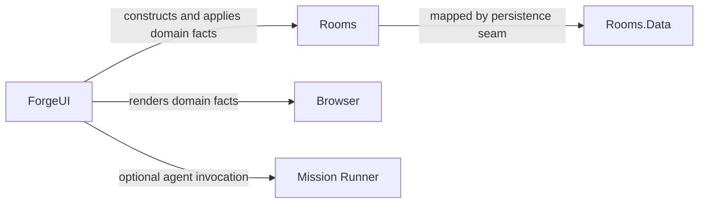

# Rooms Domain

## Purpose

Represent collaboration-domain facts and invariant helpers without binding them to the web host or a database.

## Why this exists

Room membership, append-only messages, invites, and trust semantics need a stable model shared by adapters without letting UI or persistence concerns redefine them.

## Owns

- Member, room, membership, invite, message/payload, handle parsing, and trust-integrity domain types/rules.
- The append-only message and verified-result semantics expressed by those types/helpers.

## Does not own

- Database mapping/migrations, authorization session handling, SignalR delivery, runner invocation, or billing keys/ledgers.
- Durable Conversation storage, Desktop/Application stores, or local capability execution.

## Change admission

A change belongs here only if it advances this component’s reason for existence.

For persistence, UI delivery, authentication, or model execution, compose with Rooms.Data, ForgeUI, Billing, or Runner instead.

## Use these pieces

- [Room aggregate](Room.cs), [membership](RoomMembership.cs), and [append-only message](Message.cs)
- [Mention parser](MentionParser.cs) and [verified-result guard](TrustIntegrity.cs)
- Boundary coverage: [domain invariants](../ForgeMission.Rooms.Tests/TrustIntegrityTests.cs), [mentions](../ForgeMission.Rooms.Tests/MentionParserTests.cs), and [membership persistence behavior](../ForgeMission.Rooms.Tests/RoomStoreTests.cs)

## Communicates with

## Important flows and constraints

- A room’s access control is expressed through membership, not the `Room` record itself.
- Messages are immutable appended facts; edits or reactions are new linked messages.
- A visible verified result must pass `TrustIntegrity`; a raw flag alone cannot render a green verdict.

## Related documentation

- [Architecture](../../docs/design/architecture.md)
- [Security architecture](../../docs/design/security-architecture.md)
