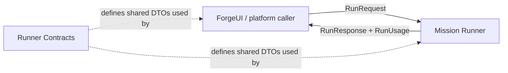

# Runner Contracts

## Purpose

Keep callers and the Runner aligned on a typed execution wire without giving the Runner ownership of caller state.

## Why this exists

Mission compute should remain replaceable and stateless while the caller keeps identity, room context, broadcast, and accounting decisions.

## Owns

- `RunRequest`, `RunResponse`, progress, tool-turn, artifact, mission-info, and usage DTOs.
- The source-generated JSON context for this wire.

## Does not own

- HTTP routes, mission loading/execution, artifact bytes, identity, billing decisions, or Room persistence.
- Desktop/Bob policy, capability execution, or durable Conversation messages.

## Change admission

A change belongs here only if it advances this component’s reason for existence.

For execution behavior or caller-side identity/accounting, compose with the Runner or its orchestrator instead.

## Use these pieces

- [Run wire types and JSON context](RunContracts.cs)
- Contract coverage: [serialization tests](../ForgeMission.Runner.Tests/RunContractsSerializationTests.cs)

## Communicates with

## Important flows and constraints

- Streaming emits zero or more progress/heartbeat events and exactly one terminal result or error.
- Artifact metadata travels here; bytes use the Runner’s dedicated upload/download projection.
- `RunUsage` is a priced signal, not a ledger mutation.

## Related documentation

- [Architecture](../../docs/design/architecture.md)
- [Security architecture](../../docs/design/security-architecture.md)
