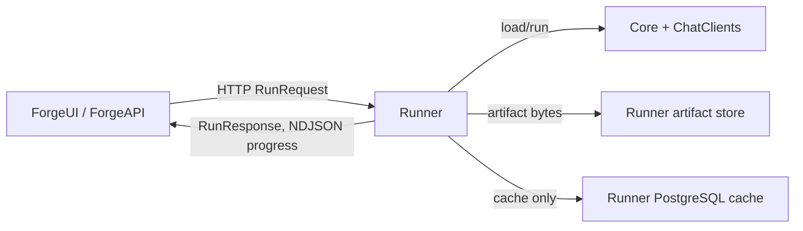

# Mission Runner

## Purpose

Run registered missions and expose their results, transient progress, artifacts, and usage over a narrow execution API.

## Why this exists

Provider-backed compute and mission loading must be isolated from presentation and account state so callers can orchestrate runs without holding provider credentials.

## Owns

- `/run`, `/run/stream`, `/missions`, artifact projections, mission registry/loading, execution mapping, and runner-owned enrichment cache.
- Provider-backed mission execution and observability for this host.

## Does not own

- Caller identity, Rooms context/membership, platform-key authentication, or debit/grant policy.
- Durable conversation coordination, Desktop/Application stores, or Bob’s local capability authorization/execution.

## Change admission

A change belongs here only if it advances this component’s reason for existence.

For caller-side policy, durable conversation state, or local capability work, compose with the platform edge, Conversation service, or Client Runtime owner instead.

## Use these pieces

- [HTTP composition and route entry points](Program.cs)
- [Execution handler](MissionRunHandler.cs), [mission registry](RunnerRegistry.cs), and [artifact store](RunnerArtifactStore.cs)
- [Shared wire](../ForgeMission.Runner.Contracts/README.md)
- Boundary coverage: [run handling](../ForgeMission.Runner.Tests/MissionRunHandlerTests.cs), [registry](../ForgeMission.Runner.Tests/RunnerRegistryTests.cs), and [cache](../ForgeMission.Runner.Tests/PostgresEnrichmentCacheTests.cs)

## Communicates with

## Important flows and constraints

- The Runner is stateless per run; its cache is isolated runner infrastructure, not `authbilling_db` or Rooms state.
- Tool-use calls are returned to the caller for execution and continuation; the Runner does not obtain Desktop/Bob capability providers.
- `/run/stream` keeps long-lived execution observable with heartbeats; it does not create a durable run history.

## Related documentation

- [Architecture](../../docs/design/architecture.md)
- [Forge architecture](../../docs/design/forge-architecture.md)
- [Security architecture](../../docs/design/security-architecture.md)
