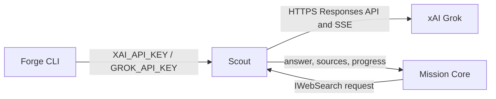

# Scout

## Purpose

Defines source-attributed web-search results and supplies the current Grok Responses API implementation.

## Why this exists

Live retrieval is an optional execution dependency with different result shapes from chat completion. A small contract keeps pipeline search steps independent from a particular search backend while retaining source attribution.

## Owns

- [`IWebSearch`](IWebSearch.cs), request/progress/result records, source attribution, and search failures.
- [`GrokWebSearch`](Grok/GrokWebSearch.cs), including buffered and SSE progress handling for xAI’s Responses API.
- Source-generated Grok wire types in [`GrokWire`](Grok/GrokWire.cs).

## Does not own

- Search-key discovery, provider-chat construction, MCL pipeline control flow, source ranking policy, or persistent retrieval storage.

## Change admission

A change belongs here only if it advances the retrieval contract or a backend implementation behind it. For environment-key wiring change `ForgeMission.Cli`; for how a `kind: search` step executes change `ForgeMission.Core`.

## Use these pieces

- [`IWebSearch`](IWebSearch.cs) is the backend-neutral contract injected into the pipeline.
- [`GrokWebSearch`](Grok/GrokWebSearch.cs) implements it with optional progress reporting.
- [`GrokWebSearchStreamTests`](../ForgeMission.Tests/Scout/GrokWebSearchStreamTests.cs) and [`SearchMissionPipelineTests`](../ForgeMission.Tests/Scout/SearchMissionPipelineTests.cs) cover stream mapping and pipeline integration.

## Communicates with

## Important flows and constraints

- `Sources` are the stable result anchor; a synthesized `Answer` is optional.
- The streaming path uses one request and reports server-side search actions without rerunning the search.
- The backend uses source-generated JSON and direct HTTP to remain AOT-compatible.

## Related documentation

- [MCL execution architecture](../../docs/design/architecture.md#execution-phases)
- [AOT rules](../../AGENTS.md#aot-first--standing-rules-for-all-new-code)
