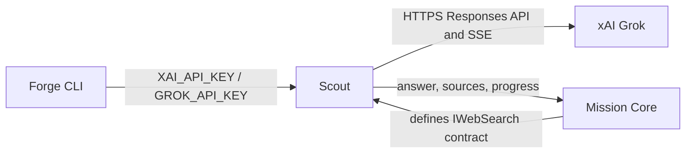

# Scout

## Purpose

Supplies the current xAI Grok Responses API implementation of Mission Core's source-attributed
web-search contract.

## Why this exists

Live retrieval is an optional external execution dependency. Scout isolates xAI HTTP/SSE handling
from provider-neutral MCL execution while retaining source attribution.

## Owns

- [`GrokWebSearch`](Grok/GrokWebSearch.cs), including buffered and SSE progress handling for xAI’s Responses API.
- Source-generated Grok wire types in [`GrokWire`](Grok/GrokWire.cs).

## Does not own

- Retrieval contract ownership, search-key discovery, provider-chat construction, MCL pipeline
  control flow, source ranking policy, or persistent retrieval storage.

## Change admission

A change belongs here only if it advances the xAI backend implementation behind Core's retrieval
contract. For environment-key wiring change `ForgeMission.Cli`; for the contract or how a
`kind: search` step executes change `ForgeMission.Core`.

## Use these pieces

- [`IWebSearch`](../ForgeMission.Core/Retrieval/IWebSearch.cs) is Core's backend-neutral contract
  injected into the pipeline.
- [`GrokWebSearch`](Grok/GrokWebSearch.cs) implements that contract with optional progress reporting.
- [`GrokWebSearchStreamTests`](../ForgeMission.Tests/Scout/GrokWebSearchStreamTests.cs) and [`SearchMissionPipelineTests`](../ForgeMission.Tests/Scout/SearchMissionPipelineTests.cs) cover stream mapping and pipeline integration.

## Communicates with

## Important flows and constraints

- `Sources` are the stable result anchor; a synthesized `Answer` is optional.
- The streaming path uses one request and reports server-side search actions without rerunning the search.
- The backend uses source-generated JSON and direct HTTP to remain AOT-compatible.

## Related documentation

- [MCL execution architecture](../../docs/design/architecture.md#execution-phases)
- [AOT rules](../../AGENTS.md#aot-first--standing-rules-for-all-new-code)
