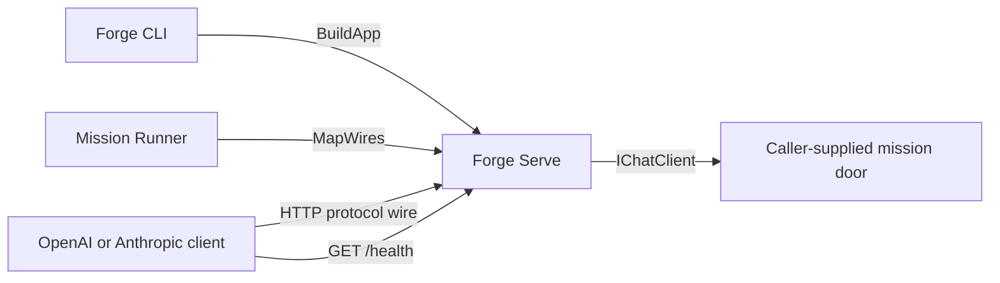

# Forge Serve

## Purpose

Maps supported OpenAI- and Anthropic-compatible HTTP wires onto one ASP.NET application supplied by a caller.

## Why this exists

CLI and Runner need identical protocol surfaces without each owning a separate web-host implementation. This library centralizes wire mapping while leaving mission execution and process lifecycle with its hosts.

## Owns

- [`ForgeServe.BuildApp`](ForgeServe.cs) for the self-contained CLI serving application.
- [`ForgeServe.MapWires`](ForgeServe.cs) for mapping supported doors onto a caller-owned application.
- The shared `/health` response and enabled-door validation.

## Does not own

- Provider-client creation, mission registry/execution, server process lifetime, identity, billing, or durable conversation coordination.

## Change admission

A change belongs here only if it advances the shared serving wire or health mapping. For a mission endpoint’s behavior change its caller (`ForgeMission.Cli` or `ForgeMission.Runner`); do not duplicate a protocol host.

## Use these pieces

- [`ForgeServe`](ForgeServe.cs) is the only public composition API.
- [`Program`](../ForgeMission.Runner/Program.cs) maps the same wires on the Runner host.
- [`ConvergedServeTests`](../ForgeMission.Tests/Integration/ConvergedServeTests.cs) and [`ClaudeCodeTests`](../ForgeMission.Tests/Integration/ClaudeCodeTests.cs) exercise the converged protocol surface.

## Communicates with

## Important flows and constraints

- At least one wire door is required; null leaves its protocol routes unmapped.
- The OpenAI and Anthropic route sets are intentionally disjoint on one application.
- `BuildApp` owns only its newly created app; `MapWires` does not claim the caller’s host lifecycle.

## Related documentation

- [Mission Runner](../ForgeMission.Runner/README.md)
- [Architecture](../../docs/design/architecture.md)
