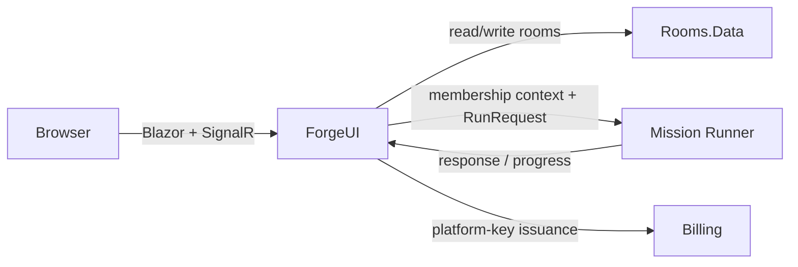

# ForgeUI

## Purpose

Provide the browser presentation and application orchestration surface for Rooms, authenticated people, and runner-backed agent replies.

## Why this exists

Browser rendering, OIDC/session handling, membership-checked delivery, and room-context assembly belong together at the presentation/application edge, not in a model, data store, or Runner.

## Owns

- Blazor/SignalR host composition, browser navigation/rendering, authentication session handling, and platform-key issuance route projection.
- Membership-checked room message delivery, room context assembly, runner calls, broadcast, and UI-specific agent directory wiring.

## Does not own

- Room domain invariants or persistence implementation, Billing ledger/key storage, or Runner mission execution.
- Durable Conversation coordination, Desktop/Application project stores, or Bob’s local capability policy/execution.

## Change admission

A change belongs here only if it advances this component’s reason for existence.

For domain rules, database access, accounting, or mission compute, compose with Rooms, Rooms.Data, Billing, or Runner instead.

## Use these pieces

- [Web composition and authentication routes](Program.cs)
- [Membership-checked send path](Services/RoomMessageService.cs), [runner adapter](Services/MissionRunnerClient.cs), and [chat hub](Hubs/ChatHub.cs)
- [Room UI](Pages/Rooms.razor) and [platform-key endpoint projection](PlatformKeyEndpoints.cs)
- Boundary coverage: [room store/integrity](../ForgeMission.Rooms.Tests/RoomStoreTests.cs), [messages](../ForgeMission.Rooms.Tests/Api/MessagesSerializationTests.cs), and [runner contract](../ForgeMission.Runner.Tests/RunContractsSerializationTests.cs)

## Communicates with

## Important flows and constraints

- `RoomMessageService` is the membership-checked human-send path; clients never provide their own sender identity.
- Runner outages disable agents but do not make Room storage unavailable; the Runner does not receive account credentials or direct store access.
- ForgeUI is a browser/Rooms surface, not the local Desktop supervisor or a Bob capability host.

## Related documentation

- [Architecture](../../docs/design/architecture.md)
- [Security architecture](../../docs/design/security-architecture.md)
- [Durable conversations](../../docs/design/durable-conversations.md)
