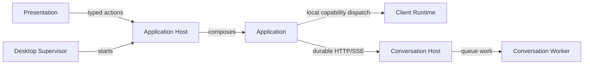

# MCL Component Atlas

Start here to find the existing architectural owner. This atlas is additive: the
[canonical Forge architecture](../docs/design/forge-architecture.md) and the
[Phase 43.23 completed record](../docs/phases/phase-43.23-domain-ownership_completed.md)
remain the authority for system design and acceptance evidence. It deliberately
does not repeat either.

## Before changing a component

Before editing code under a documented component:

1. Read the nearest README.
2. State a component-fit declaration in the task plan or PR description.
3. If the change cannot be explained as advancing that component’s “Why,” stop and locate the correct owner.

The nearest README is the closest README in the edited path: a named domain
owner outranks its project README, which outranks this atlas. If no README is in
the path, walk upward to the first one before making the placement decision.

> I am changing `ForgeMission.Application/Projects` because the work extends its responsibility for project manifest identity and mutation. It does not add mission submission or capability execution there.

## System map

- Local Desktop path: [Desktop Supervisor](ForgeMission.Desktop/README.md) starts
  [Application Host](ForgeMission.Application.Host/README.md), which composes
  [Application](ForgeMission.Application/README.md),
  [Application Transport](ForgeMission.Application.Transport/README.md), and
  [Client Runtime (Bob)](ForgeMission.ClientRuntime/README.md); [Presentation](ForgeMission.Presentation/README.md)
  speaks the typed application wire.
- Durable remote path: [Application](ForgeMission.Application/README.md) uses
  [Durable Conversation Contracts](ForgeMission.Conversations.Contracts/README.md)
  with [Conversation Host](ForgeMission.ConversationHost/README.md), which
  delegates reasoning work to [Conversation Worker](ForgeMission.ConversationWorker/README.md).

## Inventory

Every non-test project appears once below. A component link is its local source
README; use that README for ownership, public pieces, and adjacent-owner rules.

| Group | Project | Status / role |
|---|---|---|
| Mission language | [ForgeMission.Core](ForgeMission.Core/README.md) | Component — provider-neutral MCL resolution and pipeline execution. |
| Mission language | [ForgeMission.Parser](ForgeMission.Parser/README.md) | Component — source-spanned MCL syntax and diagnostics. |
| Mission language | [ForgeMission.ChatClients](ForgeMission.ChatClients/README.md) | Component — provider-SDK client boundary. |
| Mission language | [ForgeMission.Scout](ForgeMission.Scout/README.md) | Component — provider-neutral web-search contract and Grok adapter. |
| Mission language | [ForgeMission.Cli](ForgeMission.Cli/README.md) | Component — Native-AOT command composition surface. |
| Mission language | [ForgeMission.Serve](ForgeMission.Serve/README.md) | Component — shared OpenAI/Anthropic-compatible HTTP wire mapping. |
| Mission language | [ForgeMission.Docker](ForgeMission.Docker/README.md) | Component — narrow Docker operations and prerequisite checks. |
| Local application | [ForgeMission.Application](ForgeMission.Application/README.md) | Component — Project, mission, conversation, session, and observation owners. |
| Local application | [ForgeMission.Application.Transport](ForgeMission.Application.Transport/README.md) | Component — typed action, event, JSON, and channel vocabulary. |
| Local application | [ForgeMission.Application.Host](ForgeMission.Application.Host/README.md) | Component — loopback HTTP/SSE host and composition root. |
| Local application | [ForgeMission.ClientRuntime](ForgeMission.ClientRuntime/README.md) | Component — Bob’s scoped local capability policy and execution. |
| Local application | [ForgeMission.Presentation](ForgeMission.Presentation/README.md) | Component — Blazor rendering, navigation, focus, and view state. |
| Local application | [ForgeMission.Desktop](ForgeMission.Desktop/README.md) | Component — user-launched process supervision. |
| Local application | [ForgeMission.Desktop.Contracts](ForgeMission.Desktop.Contracts/README.md) | Component — native-host abstraction and Supervisor-to-Host pipe contract. |
| Local application | [ForgeMission.Desktop.Host](ForgeMission.Desktop.Host/README.md) | Component — disposable native window process. |
| Local application | [ForgeMission.Desktop.Photino](ForgeMission.Desktop.Photino/README.md) | Component — Photino implementation of the native-host contract. |
| Local application | [ForgeMission.Orchestration](ForgeMission.Orchestration/README.md) | Component — runtime endpoint resolution, readiness, and owned adapters. |
| Durable conversations | [ForgeMission.Conversations.Contracts](ForgeMission.Conversations.Contracts/README.md) | Component — versioned durable-conversation messages and projections. |
| Durable conversations | [ForgeMission.ConversationHost](ForgeMission.ConversationHost/README.md) | Component — durable conversation state and HTTP/SSE projection. |
| Durable conversations | [ForgeMission.ConversationWorker](ForgeMission.ConversationWorker/README.md) | Component — queue-driven mission reasoning and durable progress publication. |
| Durable conversations | [ForgeMission.ConversationPresentation](ForgeMission.ConversationPresentation/README.md) | Component — shared presentation-only conversation activity rendering. |
| Hosted platform | [ForgeMission.Runner.Contracts](ForgeMission.Runner.Contracts/README.md) | Component — typed mission-run request, result, progress, artifact, and usage wire. |
| Hosted platform | [ForgeMission.Runner](ForgeMission.Runner/README.md) | Component — stateless mission-execution host. |
| Hosted platform | [ForgeMission.Api](ForgeMission.Api/README.md) | Component — platform-key-authenticated mission ingress and account settlement. |
| Hosted platform | [ForgeMission.Billing](ForgeMission.Billing/README.md) | Component — accounts, platform keys, pricing, balances, and ledgers. |
| Hosted platform | [ForgeMission.Rooms](ForgeMission.Rooms/README.md) | Component — collaboration-domain facts and invariants. |
| Hosted platform | [ForgeMission.Rooms.Data](ForgeMission.Rooms.Data/README.md) | Component — Rooms EF Core persistence and schema ownership. |
| Hosted platform | [ForgeUI](ForgeUI/README.md) | Component — authenticated browser/Rooms host and membership-checked orchestration. |
| Diagnostic | [ForgeMission.Application.TransportProbe](ForgeMission.Application.TransportProbe/Program.cs) | Excluded — diagnostic executable that proves a non-Desktop use of the transport contract; its owner is [Application Transport](ForgeMission.Application.Transport/README.md). |
| Diagnostic | [ForgeMission.ProjectServiceProbe](ForgeMission.ProjectServiceProbe/Program.cs) | Excluded — diagnostic executable for Project-service crash and concurrent-write scenarios; its owner is [Application](ForgeMission.Application/README.md). |

The 28 linked components are the documented source-adjacent boundaries. The two
diagnostic probes are deliberately excluded from component status: they exercise
their owners and do not introduce a separate runtime, store, host, or service.
